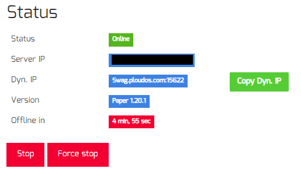

# Simple PloudOS DynamicIP Copy 
Simple userscript that adds a button on your server manage page to copy dynamic IP address on ploudos.com. Will only appear when your server is started.

## Installation
1. Install a userscript manager like [Tampermonkey](https://www.tampermonkey.net/) (A chrome extensioon)
2. Click on [this](https://github.com/HageFX-78/Simple-PloudOS-DynamicIP-Copy/raw/main/PloudDynIP.user.js) and install.

## Installation (Alternative)
1. Install a userscript manager like [Tampermonkey](https://www.tampermonkey.net/) (A chrome extensioon)
2. Navigate to [Greasy Fork](https://greasyfork.org/en/scripts/471830-simple-ploudos-dynamicip-copy) and just install it from there. (No sign up required)

### How it would look like with the script:

